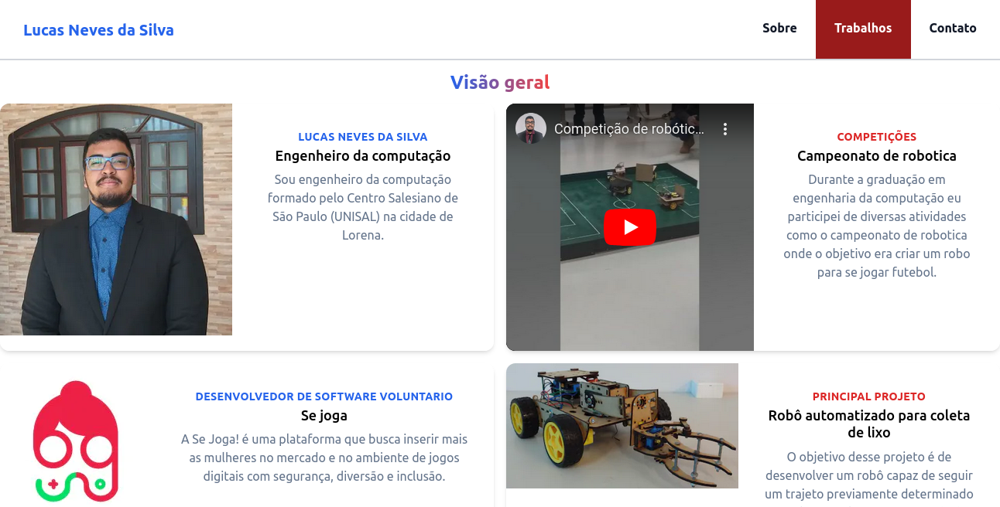

# Portfolio

Portfolio pessoal feito em Reactjs e Tailwind 

## Funcionalidades

- Temas dark e light
- Resposividade
- Envio de e-mail para contato pelo site


## Demonstração



<a href="https://portfolio-taunt-byte.vercel.app/">Site em funcionamento</a>

## Variáveis de Ambiente

Para configurar o ambiente de desenvolvimento para o React, você precisa seguir alguns passos básicos:

1) Instale o Node.js: O React é construído com o Node.js, então você precisará instalá-lo em seu sistema. 

    Você pode baixá-lo no site oficial do Node.js (https://nodejs.org/).

2) Instale o gerenciador de pacotes NPM: O NPM é um gerenciador de pacotes que é incluído com o Node.js onde ele é usado para instalar e gerenciar dependências do projeto. 

    Verifique se o NPM está instalado em seu sistema executando o comando 

        npm -v 

Se não estiver instalado, você pode instalá-lo junto com o Node.js.


## Instalação

Instale as dependecias com npm

```bash
  cd app
  npm i
```
    
## Rodando localmente

Clone o projeto

```bash
  git clone git@github.com:Taunt-byte/Portfolio.git
```

Entre no diretório do projeto

```bash
  cd Portfolio
  cd app
```

Instale as dependências

```bash
  npm i
```

Inicie o servidor

```bash
  npm run start
```


## Feedback

Se você tiver algum feedback, por favor nos deixe saber por meio de lucasluan94@hotmail.com

